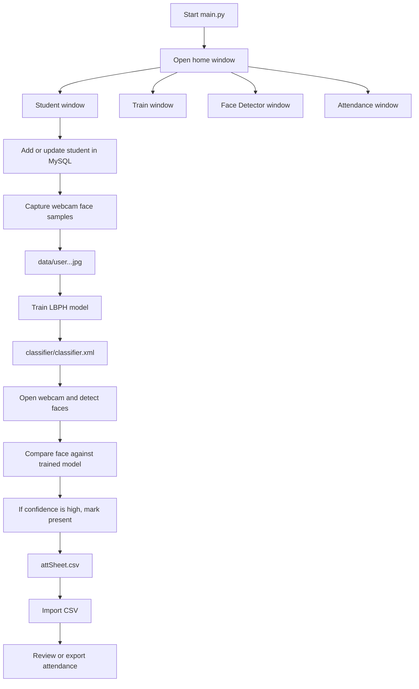

# Software Flow

This document explains how the face recognition attendance system works from startup to attendance export.

## End-to-End Flow

## What Each Screen Does

### 1. Home Window (`main.py`)

The application starts here. The home screen only acts as a launcher:

- `Student` opens the student management window.
- `Train Face` opens the training window.
- `Detect Face` opens the live recognition window.
- `Attendance` opens the CSV attendance window.
- `Photos` opens the `data/` folder.

### 2. Student Management (`studentV2f.py`)

This is where student identity data is created and maintained.

The user enters:

- department
- roll number
- email
- year
- semester
- subject
- photo sample status

The window can then:

- save the student record in MySQL
- update an existing record
- delete a record
- reset the form
- capture face samples from the webcam

When face samples are captured, the app saves grayscale crops into `data/` using the student roll number in the filename.

### 3. Face Sample Capture

The sample-capture flow is embedded in the Student window.

The camera runs in a loop, detects a face using OpenCV Haar cascades, crops the face area, converts it to grayscale, and writes multiple training images.

This gives the later training step labeled image data that is tied to the student roll number.

### 4. Training (`trainV2f.py`)

The Train window reads all images inside `data/`.

For each file:

- the image is opened in grayscale
- the student ID is extracted from the filename
- the face image and ID are added to the training set

The LBPH recognizer is then trained and saved to `classifier/classifier.xml`.

This file is required before live recognition can work.

### 5. Live Face Detection (`face_detectorV2f.py`)

The Face Detector window:

- opens the webcam
- loads the Haar cascade face detector
- loads `classifier/classifier.xml`
- detects faces in each frame
- predicts the matching student ID
- looks up that student in MySQL
- writes attendance if the match confidence is high enough

For a recognized student, the app writes a row into `attSheet.csv` with roll number, department, year, time, date, and status.

If the face is not confident enough, the frame is labeled as unknown and no attendance row is written.

### 6. Attendance Review (`attendenceV2f.py`)

The Attendance window is a CSV viewer/editor.

It can:

- import a CSV file into the table
- display attendance rows
- export the current table back to CSV
- reset the visible form fields

It does not create attendance on its own. It only displays or saves attendance data that already exists in CSV form.

## Data and File Flow

The software creates and consumes these key files:

- `data/` for captured face samples
- `classifier/classifier.xml` for the trained recognizer
- `attSheet.csv` for the attendance log

The included `database_setup.sql` creates the MySQL database and the `student` table.

The included `config.ini` stores local MySQL connection settings for the repo.

## Practical Usage Order

1. Run `database_setup.sql` in MySQL.
2. Edit `config.ini` if needed.
3. Start `main.py`.
4. Open Student and add a student.
5. Capture face samples for that student.
6. Train the model.
7. Open Face Detector to recognize faces and record attendance.
8. Open Attendance to import, inspect, or export the CSV log.

## Important Dependency

Live recognition depends on `cv2.face`, which is provided by `opencv-contrib-python`, not the base OpenCV package.